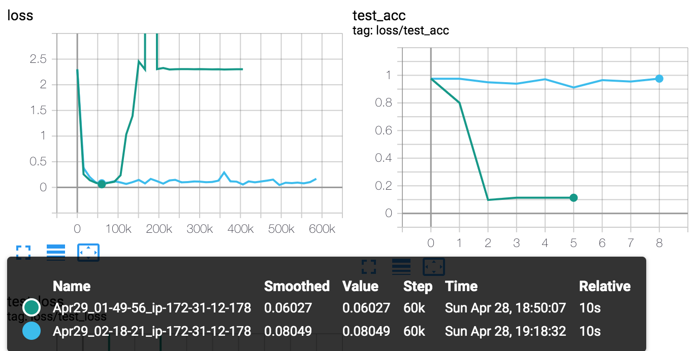
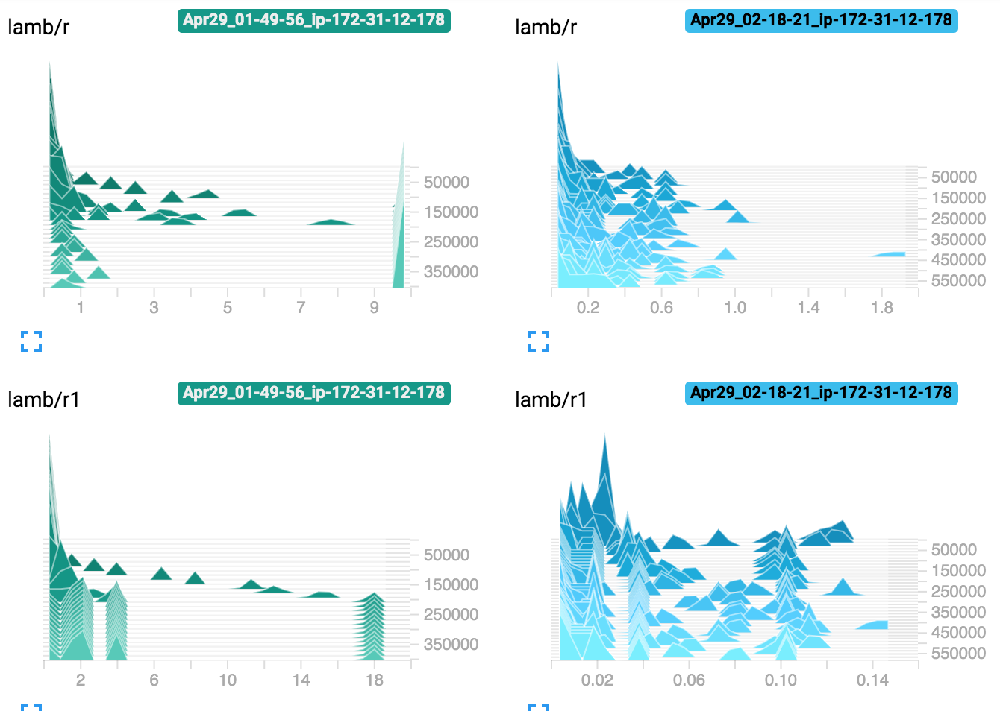

Implementation of https://arxiv.org/abs/1904.00962 for large batch, large learning rate training.

The paper doesn't specify clamp values for ϕ, so I use 10.

Bonus: TensorboardX logging (example below).

## Try the sample
```
git clone git@github.com:cybertronai/pytorch-lamb.git
cd pytorch-lamb
pip install -e .
python test_lamb.py
tensorboard --logdir=runs
```

## Sample results
At `--lr=.02`, the Adam optimizer is unable to train.

Red: `python test_lamb.py --batch-size=512 --lr=.02 --wd=.01 --log-interval=30 --optimizer=adam`

Blue: `python test_lamb.py --batch-size=512 --lr=.02 --wd=.01 --log-interval=30 --optimizer=lamb`


